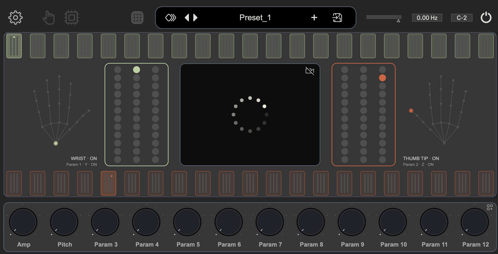

# GestureCap Expressive Instrument

An experimental framework for mapping camera-based hand gestures to expressive sound synthesis in Max/MSP and Gen~.

GestureCap Expressive Instrument connects gesture data received over OSC to configurable musical mappings and a wavetable-based sound engine. It is the final integration and demonstration repository for building playable relationships between movement and sound.

> This is a research demonstrator, not a finished commercial instrument. Higher-level gesture-state and cluster integration is still being tested, and development will continue after the GSoC coding period.

<p align="center">
  
</p>

<p align="center"><em>The Max/MSP environment combines OSC input, landmark visualization, routing, mapping controls, and wavetable synthesis.</em></p>

## System Overview

```text
Camera / Performer
        ↓
MediaPipe or Gesture Recognition
        ↓
OSC
        ↓
Routing Matrix
        ↓
Ranges / Curves / Thresholds / Triggers
        ↓
Musical Controls
        ↓
Gen~ / Wavetable Engine
        ↓
Expressive Instrument
```

## Requirements

- Max/MSP with Node for Max support;
- macOS on Apple silicon for the bundled camera tracker;
- Python 3 only when using the optional MusicXML virtual performer.

The live MediaPipe pipeline does **not** require a separate Python installation. The bundled `tracker/doublehand_mp/` application was built with PyInstaller and includes its own Python runtime, MediaPipe model, and dependencies. The repository layout must be preserved because the Max launcher resolves the tracker through a relative path.

The bundled Apple-silicon tracker is code-signed and its signature and notarization were verified on macOS. A release archive is intended to be attached to the `v0.1.0` GitHub pre-release for transport between compatible Apple-silicon Macs.

## Running the Live MediaPipe Pipeline

1. Clone or download the complete repository, including `tracker/doublehand_mp/`.
2. Open the Max project:

   ```text
   max/gesturecap-expressive-instrument/gesturecap-expressive-instrument.maxproj
   ```

3. In the Max interface, select the **GestureCap** OSC pipeline when working with live MediaPipe landmarks.
4. Click the camera icon in the upper-left area of the interface.

The camera control sends `camera_on` to Node for Max. The script [`run_mediapipe_maxmsp_project.js`](max/gesturecap-expressive-instrument/code/run_mediapipe_maxmsp_project.js) then launches:

```text
tracker/doublehand_mp/doublehand_mp
```

Clicking the camera control again sends `camera_off`, stops the tracker process, and releases the camera. macOS may ask for camera permission the first time Max launches the tracker.

Because the tracker is self-contained, this workflow launches MediaPipe without activating a Python environment or running a Python command manually.

## Running the MusicXML Virtual Performer

[`virtual_performer.py`](virtual_performer.py) is a test and debugging utility. It reads a monophonic MusicXML score and sends simulated two-hand MediaPipe landmark frames over OSC, allowing the routing, mapping, visualization, and synthesis pipeline to be tested without a camera or live performer.

### Configure Max/MSP

1. Click the **gear icon in the upper-left corner** to open the **Params** panel.
2. Set the OSC address to `127.0.0.1`.
3. Set the OSC port to `11112`.
4. Select **OSC Pipeline XML** for the MusicXML simulator. Select **GestureCap** instead when receiving live landmarks from the bundled tracker.
5. Recall **Preset 1** before starting the simulator.

The included [`Preset_1.json`](max/gesturecap-expressive-instrument/data/Preset_1.json) is the reference mapping for the supplied MusicXML score. With **Preset 1** and **OSC Pipeline XML** selected, the simulated pitch and gain gestures are routed coherently through the instrument. Other presets may use different mappings.

### Run the simulator from Terminal

From the repository root:

```bash
python3 -m venv .venv
source .venv/bin/activate
python -m pip install -r requirements.txt
python virtual_performer.py le-cygne-the-swan.mxl --host 127.0.0.1 --port 11112
```

The included score loops continuously. Stop playback with `Ctrl+C`.

To validate the score without sending OSC:

```bash
python virtual_performer.py le-cygne-the-swan.mxl --dry-run
```

The simulator sends complete 21-landmark hands to:

```text
/hand/right [63 floats]
/hand/left  [63 floats]
```

The normalized musical controls are embedded in the landmark data: right thumb-tip Z carries logarithmic pitch, and left wrist Y carries gain. The virtual performer does not output MIDI and does not require MediaPipe.

## Current Capabilities

- launch a self-contained MediaPipe tracker directly from Max/MSP;
- receive and visualize two-hand landmark data over OSC;
- calibrate, normalize, constrain, curve, threshold, and route inputs;
- turn continuous values into musical parameters and discrete triggers;
- test the pipeline repeatably with a MusicXML-driven virtual performer;
- reconstruct representative waveform cycles from recorded instruments;
- prepare and validate wavetable material for Gen~;
- connect the mapping layer to an experimental wavetable instrument.

## Project Status

The current result is a functional research prototype and a reusable mapping framework. The live tracker and virtual performer provide two complementary ways to exercise the instrument, but the complete integration may still contain bugs.

Remaining work includes:

- final end-to-end and performer testing;
- evaluation of landmark, state, and cluster mappings;
- packaging and checksum verification of the tracker release archive;
- verification of cross-platform behaviour;
- further refinement of the complete instrument.

## Google Summer of Code 2026

GestureCap Expressive Instrument was undertaken as the final integration stage and master repository of the **Expressive Gesture-to-Sound Mapping Framework for GestureCap**, developed as a Google Summer of Code 2026 contribution with [INCF](https://www.incf.org/).

The planned **`v0.1.0` pre-release** represents the work-product snapshot achieved during the GSoC coding period. It records the state of the integrated demonstrator at the end of the session, including its known limitations. Development on `main` will continue after the coding period with bug fixes, testing, and instrument refinements; later versions should be identified separately from the GSoC snapshot.

The historical work-product report is maintained in the [GSoC 2026 Final Report](https://gist.github.com/mikaelmolliex/a39c0abee72ecc4d10f75a48ff30dd23). It documents the project's goals, evolution, contributions, deliverables, limitations, lessons learned, and future work at the end of the GSoC period.


## Related Repositories

- [GestureCap OSC — Part A](https://github.com/mikaelmolliex/gesturecap-osc)
- [Wavetable Reconstruction — Part B](https://github.com/mikaelmolliex/wavetable-reconstruction)
- [GestureCap Expressive Instrument — Master Integration](https://github.com/mikaelmolliex/gesturecap-expressive-instrument)

## Contributors and Acknowledgements

**Contributor:** [Mikael Molliex](https://github.com/mikaelmolliex)  
**Mentors:** Suresh Krishna and Deepansh Goel  
Interface icons are provided by [Iconoir](https://iconoir.com/).

Thanks to INCF and Google Summer of Code for supporting this work. Additional acknowledgements are included in the [final report](https://gist.github.com/mikaelmolliex/a39c0abee72ecc4d10f75a48ff30dd23).
